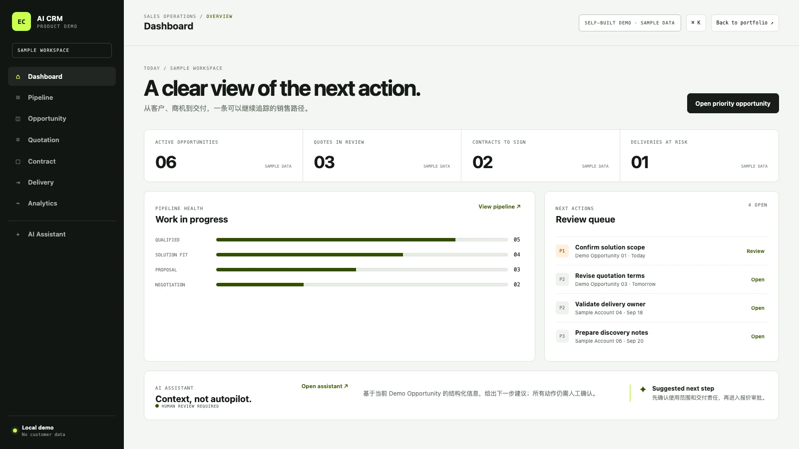

# AI CRM Sales Copilot

A browser-based sales workflow demo that keeps pipeline, forecast, audit and rule-based guidance on one local state model.

**LIVE_DEMO / RULE-BASED ASSISTANT** · [Try the browser demo](https://zhouey314-cloud.github.io/ai-crm-sales-copilot/) · [Case study](docs/case-study.md) · [Resume bullets](docs/resume-bullets.md) · [Interview notes](docs/interview-notes.md)

[](https://github.com/zhouey314-cloud/ai-crm-sales-copilot/actions/workflows/ci.yml)



> Self-built product demo / synthetic data

This repository is a browser-based demonstration of a connected sales
workflow: customer context → opportunity → quotation → contract → delivery →
forecast → human-reviewed assistant guidance.

It is not a production CRM and it does not contain customer records.

## What exists

- Dashboard, six-stage pipeline (Lead → Qualified → Proposal → Negotiation → Won / Lost), opportunity detail, quotation, contract, delivery, analytics, manager and assistant views.
- A responsive UI with eight fictional opportunities, sample amounts/owners/activities, local structured persistence, explicit human-clicked stage transitions and a local audit trail. Existing v1 demo data is migrated on load.
- A deterministic rule-based assistant whose recommendation changes with stale activity, unanswered proposal, missing decision maker, high sample value or closed stage.
- Manager View computes stage counts, active fictional pipeline, weighted sample forecast, stale items and risk queue from the same local records.

## What is mock

- All records are synthetic.
- Assistant responses are `MOCK / RULE-BASED / NOT_CONNECTED`, not LLM output. The input note is illustrative and does not affect the rules.
- There is no server database, authentication, real model provider, email, WhatsApp or
  automatic follow-up.
- Advancing a stage or marking Lost with a reason in an opportunity drawer writes a structured JSON store to this browser's localStorage. Other create/export actions remain presentation-only unless the page explicitly says otherwise.

## Quick start

Live static preview: <https://zhouey314-cloud.github.io/ai-crm-sales-copilot/>.
The preview stores changes only in the visitor's own browser; it is not a
shared CRM service.

Requirements: Node.js 18+ or Python 3.10+.

```bash
npm test
npm run serve
```

Then open <http://localhost:8787>.

## Architecture

The demo is intentionally small:

```text
index.html       views and synthetic records
app.js           navigation, drawers and deterministic demo interactions
crm-store.js     local structured store, audit and mock/external provider states
style.css        layout and responsive presentation styles
system-font.css  local/system font stack
tests/           offline smoke checks
```

## Privacy and data boundary

The repository contains no real customer names, contact details, credentials,
contracts or financial records. Replace the sample data only after adding a
separate privacy review and a real storage/authentication design.

## Status and limitations

Status: public static demonstration project. The UI, local persistence, rule branch tests and browser interactions are verified locally. GitHub Pages hosts the same client-side demo, not a server CRM. Production integrations, model quality, server persistence, permissions and durable audit retention are not implemented. Sample amounts are fictional and not revenue.

## License

MIT. See [LICENSE](LICENSE).
